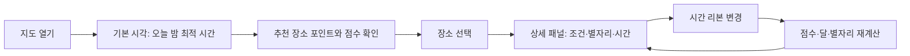

# 별 관측 장소 지도 설계서

> 상태: 구현 전 설계안  
> 대상: `skala-vue` Vue 3 애플리케이션  
> 범위: 대한민국 우선, 오늘 밤과 향후 7일의 별 관측 장소·시간·별자리 안내

## 1. 목표와 성공 기준

### 사용자 문제

사용자는 별을 보러 갈 때 다음 세 가지를 한 번에 판단하기 어렵다.

1. 도시 불빛이 적어 하늘이 충분히 어두운 장소인가?
2. 원하는 시간에 구름·강수·달빛 조건이 좋은가?
3. 그 장소와 시간에 어떤 별자리를 실제로 볼 수 있는가?

이 기능은 위 질문에 대해 **장소, 시간, 근거, 관측 대상**을 한 지도에서 제공한다.

### MVP 성공 기준

- 사용자가 지도에서 후보 장소를 선택하고 오늘 밤의 최적 관측 시간을 확인할 수 있다.
- 시간 슬라이더를 바꾸면 장소 점수, 날씨 조건, 달, 관측 가능 별자리가 같은 시간 기준으로 갱신된다.
- 별자리는 지평선 아래이거나 밝은 황혼에 노출되지 않는다.
- 각 추천 점수는 광공해·구름·달빛·시정·바람의 근거를 표시한다.
- 데이터가 없거나 신뢰도가 낮을 때 정확한 값처럼 보이지 않으며, 기준 시각과 데이터 출처를 표시한다.

### 비목표

- 경로 안내, 숙박 예약, 캠핑장 예약
- 천체 사진 촬영 설정 자동 추천
- 전국 모든 좌표를 실시간으로 정밀 점수화
- 전문 천문대급 대기 보정 또는 실측 SQM 대체

## 2. 전제와 의사결정

| 항목 | 결정 | 이유 |
| --- | --- | --- |
| 초기 지역 | 대한민국 | 기존 프로젝트가 기상청·한국 좌표 기반 기능을 보유함 |
| 추천 단위 | 검증된 관측 후보지 | 모든 좌표를 계산하는 것보다 장소 품질, 비용, 설명 가능성이 좋음 |
| 지도 엔진 | MapLibre GL JS | 래스터 광공해 레이어, 포인트, 줌·팬 구현에 적합함 |
| 천문 계산 | 클라이언트 계산 | 위도·경도·시간만으로 재현 가능하고 API 호출을 줄일 수 있음 |
| 날씨 조회 | 서버 BFF를 통한 기상청 우선 + 보조 API | API 키 보호, 캐시, 다수 장소 조회 제어 |
| 광공해 | 라이선스를 확보한 VIIRS 기반 자체 레이어 | 참조 서비스의 타일·수치를 무단 재사용하지 않음 |

> **중요:** VIIRS 야간광은 지상에서 우주로 방출되는 빛의 위성 관측치다. 이를 곧바로 실제 하늘 밝기(SQM)로 단정하지 않는다. 초기에는 `위성 기반 어두움 등급`으로 노출하고, 현장 SQM·사용자 제보를 확보한 뒤 보정한다.

## 3. 사용자 흐름



1. 앱은 사용자의 현재 위치 또는 마지막 지도 영역을 중심으로 연다.
2. 기본 시각은 오늘의 가장 높은 점수를 가진 야간 시간이다.
3. 지도에는 후보지의 대표 점수만 보여준다.
4. 사용자가 후보지를 선택하면 상세 패널에 추천 시간, 조건, 별자리를 표시한다.
5. 사용자가 시간 리본을 바꾸면 선택 장소와 지도 후보지의 점수를 해당 시각으로 갱신한다.

## 4. 화면 설계

### 4.1 지도 화면

```text
┌────────────────────────────────────────────────────────────────────┐
│ ✦ 별보기  [지역·산·캠핑장 검색]                    8월 23일 · KST │
├────────────────────────────────────────────────────────────────────┤
│ [관측 추천] [광공해] [구름]                                      │
│                                                                    │
│                         지도 + 광공해/날씨 레이어                  │
│        ● 86 화천         ● 72 양평          ● 31 서울             │
│                                                        ┌──────────┐│
│                                                        │ 화천 86 ││
│                                                        │ Bortle 3││
│                                                        │ 구름 19%││
│                                                        │ 달 초승 ││
│                                                        │ 백조자리││
│                                                        └──────────┘│
│  하늘 밝기 범례                                                    │
├────────────────────────────────────────────────────────────────────┤
│ 오늘 밤 관측 창  19  20  21  [22] [23] [00] 01  02               │
└────────────────────────────────────────────────────────────────────┘
```

### 4.2 지도 레이어

| 레이어 | 목적 | 표시 방식 |
| --- | --- | --- |
| 관측 추천 | 사용자가 바로 후보지를 고르게 함 | 점수 색상 포인트와 상위 후보지 라벨 |
| 광공해 | 장소의 장기적 어두움 비교 | 반투명 래스터, SQM/등급 범례 |
| 구름 | 선택 시각의 단기 변동 확인 | 시간별 운량 히트맵 또는 반투명 격자 |

- 한 번에 한 레이어를 주 레이어로 강조한다.
- `관측 추천`을 기본값으로 한다.
- 베이스맵은 어두운 색상으로 하고, 광공해 색상 범례와 충분히 대비되게 한다.
- 지도 이동 후에는 보이는 영역의 후보지와 예보만 요청한다.

### 4.3 장소 상세 패널

필수 정보만 노출한다.

| 구역 | 항목 |
| --- | --- |
| 제목 | 장소명, 행정구역, 추천 순위, 데이터 시각 |
| 점수 | 관측 적합도, 추천 시간 범위 |
| 근거 | 어두움 등급, 구름, 달빛, 시정, 강수/바람 |
| 별자리 | `선명`, `관측 가능`, `관측 어려움` 그룹과 방위·고도 |
| 신뢰도 | 광공해·날씨 데이터의 갱신일과 신뢰도 |

`관측 계획 보기`를 누르면 별자리별 관측 가능 시간과 방위를 담은 별도 패널로 전환한다. MVP에서 즐겨찾기·알림·공유는 추가하지 않는다.

### 4.4 반응형 원칙

- 데스크톱: 지도 위 우측에 300px 내외 상세 패널을 띄운다.
- 모바일: 상세 패널은 지도 하단에 고정된 바텀시트로 표시한다.
- 모바일에서는 검색 입력을 아이콘 버튼으로 축소하고, 범례는 접을 수 있게 한다.
- 시간 리본은 항상 보이게 하되, 화면이 좁으면 가로 스크롤하지 않고 8개 시간 단위를 균등 배치한다.

## 5. 관측 적합도 규칙

### 5.1 하드 게이트

아래 중 하나라도 만족하면 `추천 불가`로 처리하며 점수를 표시하지 않는다.

| 조건 | 기준 | 사용자 문구 |
| --- | --- | --- |
| 밝은 낮 | 태양 고도 `>= -12°` | 아직 하늘이 충분히 어둡지 않음 |
| 강수 | 해당 시각 강수량 `> 0` 또는 강수 예보 | 강수 예보가 있음 |
| 과도한 구름 | 총 운량 `>= 85%` | 구름이 많아 관측이 어려움 |
| 별자리 고도 | 대상 별자리 대표별이 모두 고도 `< 20°` | 지평선 아래 또는 너무 낮음 |

`-12° ~ -18°`는 일반 별자리 관측은 가능할 수 있으나 천체사진·은하수에는 불리하다. 이 시간대는 `황혼` 상태로 별도 표시한다.

### 5.2 점수 계산

하드 게이트를 통과한 시각에만 다음 가중치를 사용한다.

```text
score = darkness * 0.35
      + cloud     * 0.30
      + moon      * 0.20
      + visibility* 0.10
      + comfort   * 0.05
```

| 항목 | 범위 | 계산 원칙 |
| --- | --- | --- |
| `darkness` | 0–100 | 후보지의 고정 광공해 등급을 정규화 |
| `cloud` | 0–100 | 총 운량을 기본으로 하되, 저층·중층 구름에 더 큰 감점 |
| `moon` | 0–100 | 달의 조도, 고도, 달-대상 각거리를 함께 반영 |
| `visibility` | 0–100 | 시정(m), 안개/저층운, 습도 보조값을 사용 |
| `comfort` | 0–100 | 풍속과 기온으로 관측 편의만 반영 |

점수는 정수로 반올림하고, 항상 항목별 원자료와 함께 표시한다. 사용자가 점수만 보고 판단하지 않도록 `점수의 근거`를 숨기지 않는다.

### 5.3 최적 시간 창

- 한 시간 단위로 점수를 계산한다.
- 연속한 두 시간 이상이 `80점 이상`이면 `추천 시간 창`으로 묶는다.
- 가장 긴 시간 창을 우선하고, 길이가 같으면 평균 점수가 높은 창을 선택한다.
- 점수 차가 작다면 `추천 1위` 대신 `조건 비슷함`을 표시한다.

## 6. 별자리 계산과 표시

### 6.1 입력 데이터

별자리 카탈로그는 계절별 대표 별자리만 먼저 포함한다.

```ts
type ConstellationDefinition = {
  id: string // IAU 약어, 예: "CYG"
  nameKo: string
  nameEn: string
  keyStars: Array<{
    name: string
    raHours: number
    decDegrees: number
    magnitude: number
  }>
}
```

MVP 대상은 계절별로 5–8개씩, 총 24개 안팎으로 시작한다. 전체 88개 별자리는 별자리 선·영역 렌더링을 도입할 때 확장한다.

### 6.2 판정 알고리즘

1. 선택 장소·시각에서 각 대표별의 고도와 방위를 계산한다.
2. 고도 `>= 20°`이고, 예상 한계등급보다 밝은 대표별을 센다.
3. 태양 고도, 달빛, 광공해를 반영해 예상 한계등급을 구한다.
4. 결과를 아래 상태 중 하나로 분류한다.

| 상태 | 조건 |
| --- | --- |
| 선명 | 대표별 3개 이상이 기준 고도·밝기를 만족 |
| 관측 가능 | 대표별 2개 이상은 보이나 광공해·달빛·낮은 고도 영향이 있음 |
| 관측 어려움 | 대표별이 부족하거나 모두 낮음 |

별자리 카드에는 이름뿐 아니라 `동쪽 55° · 고도 48° · 22:10–01:30`처럼 실제 관측에 필요한 정보를 표시한다.

### 6.3 천문 엔진

Astronomy Engine을 사용해 관측자 위치 기준 태양·달·별의 고도와 방위를 계산한다. 이 라이브러리는 수평 좌표와 별자리 판정을 지원한다.

- 라이브러리: [Astronomy Engine](https://github.com/cosinekitty/astronomy)
- 시간: 모든 API·계산에는 ISO 8601 UTC를 사용하고, UI에서만 `Asia/Seoul`로 표시한다.
- 고도: 대기 굴절 보정 사용 여부를 한 곳에서 고정해 결과가 흔들리지 않게 한다.

## 7. 데이터와 API

### 7.1 데이터 출처

| 데이터 | MVP 소스 | 용도 | 갱신 |
| --- | --- | --- | --- |
| 단기예보 | 기상청 단기예보 | 강수, 하늘상태, 풍속, 기온 | 발표 주기마다 |
| 보조 예보 | Open-Meteo 또는 계약된 예보 API | 시정, 총·저·중·고층 운량 | 시간별 |
| 광공해 | 라이선스를 확보한 VIIRS 기반 데이터 | 장기 어두움 등급 | 연간 또는 분기 |
| 천문 | 앱 내 카탈로그 + Astronomy Engine | 달, 태양, 별자리 | 요청 시 |
| 장소 | 운영 데이터 | 좌표, 접근성, 고도, 메모 | 수동 검수 |

Open-Meteo의 Forecast API는 시간별 총·저·중·고층 운량과 시정 변수를 제공한다. 기상청 응답만으로 해당 정보가 부족한 경우에만 보조한다. [Open-Meteo Forecast API](https://open-meteo.com/en/docs)

VIIRS Black Marble 계열 자료는 야간광 레이어의 기반으로 사용할 수 있다. [NASA Black Marble 개요](https://gis.earthdata.nasa.gov/portal/home/item.html?id=12b97384e1aa435eb2c0853df257b2fe)

### 7.2 후보지 데이터

`src/data/stargazingSites.json`에 시작하고, 운영 데이터가 필요해지면 서버 DB로 이동한다.

```ts
type StargazingSite = {
  id: string
  name: string
  region: string
  latitude: number
  longitude: number
  elevationM: number | null
  darknessScore: number // 0–100, 정적 데이터
  bortleEstimate: number | null
  accessNote: string | null
  verifiedAt: string // ISO date
}
```

후보지는 최소한 좌표, 접근성, 마지막 검수일을 가진다. 실제 도로 진입이 어렵거나 사유지인 장소는 점수가 높아도 노출하지 않는다.

### 7.3 BFF API 계약

클라이언트가 외부 예보 API를 직접 호출하지 않고 BFF를 경유한다. API 키를 보호하고 동일 시간대의 여러 사용자 요청을 캐시할 수 있다.

#### 지도 후보지 조회

```http
GET /api/stargazing/sites?west=126.0&south=37.0&east=128.0&north=38.5&at=2026-08-23T14:00:00Z
```

```ts
type SiteMapResponse = {
  requestedAt: string
  sites: Array<{
    id: string
    latitude: number
    longitude: number
    score: number | null
    status: 'recommended' | 'conditional' | 'unavailable'
    reason: string | null
  }>
}
```

#### 장소 상세 조회

```http
GET /api/stargazing/sites/{siteId}?at=2026-08-23T14:00:00Z
```

```ts
type SiteDetailResponse = {
  site: StargazingSite
  requestedAt: string
  timezone: 'Asia/Seoul'
  score: number | null
  status: 'recommended' | 'conditional' | 'unavailable'
  bestWindow: { start: string; end: string } | null
  factors: {
    darkness: { score: number; bortleEstimate: number | null }
    cloud: { score: number; totalPercent: number; lowPercent: number | null }
    moon: { score: number; illuminationPercent: number; altitudeDegrees: number }
    visibility: { score: number; meters: number | null }
    comfort: { score: number; windSpeedMps: number; temperatureC: number }
  }
  constellations: Array<{
    id: string
    nameKo: string
    state: 'clear' | 'visible' | 'difficult'
    azimuthDegrees: number
    altitudeDegrees: number
    visibleFrom: string | null
    visibleUntil: string | null
  }>
  sources: Array<{ name: string; updatedAt: string | null; confidence: 'high' | 'medium' | 'low' }>
}
```

### 7.4 캐시 정책

| 데이터 | 키 | TTL |
| --- | --- | --- |
| 예보 원본 | 제공자 + 좌표 격자 + 발표 시각 | 다음 발표 시각 또는 최대 3시간 |
| 장소별 점수 | 사이트 ID + 시간 | 1시간 |
| 별자리 계산 | 위도/경도 반올림 + 시간 | 1시간 |
| 광공해 | 타일/장소 ID | 데이터 버전이 바뀔 때까지 |

후보지를 최대 300개로 시작하고, 현재 지도 영역의 장소만 점수화한다. 전국 모든 좌표에 대한 요청은 MVP 범위에서 금지한다.

## 8. 프런트엔드 구조

### 8.1 라우트

```ts
{
  path: '/stargazing',
  name: 'stargazing-map',
  component: () => import('../views/StargazingMapView.vue'),
}
```

### 8.2 컴포넌트

```text
src/
  views/
    StargazingMapView.vue
  components/stargazing/
    StargazingMap.vue          # MapLibre 초기화와 지도 이벤트
    MapLayerToggle.vue         # 추천/광공해/구름 레이어 선택
    ObservationTimeRibbon.vue  # 야간 시간 선택
    SiteMarker.vue             # 점수 포인트 표현
    SiteDetailPanel.vue        # 선택 장소 상세
    ObservationFactors.vue     # 점수 근거
    ConstellationList.vue      # 별자리 상태 목록
  composables/
    useStargazingSites.js      # BFF 조회 및 캐시 상태
    useObservationScore.js     # UI용 점수 가공
    useAstronomy.js            # 태양·달·별자리 계산
  api/
    stargazing.js              # BFF 호출
  data/
    stargazingSites.json
    constellations.json
  utils/
    observationScore.js        # 순수 점수 함수
    constellationVisibility.js # 순수 판정 함수
```

### 8.3 상태 모델

`StargazingMapView.vue`가 아래 상태만 소유하고 하위 컴포넌트에는 props/event로 전달한다.

```ts
const selectedTime = ref<Date>(defaultBestTime)
const activeLayer = ref<'recommendation' | 'lightPollution' | 'cloud'>('recommendation')
const selectedSiteId = ref<string | null>(null)
const mapBounds = ref<LngLatBounds | null>(null)
```

- 선택 시간과 장소가 바뀌면 상세 데이터를 다시 가져온다.
- 지도 이동이 끝난 뒤에만 후보지 요청을 한다.
- 레이어 변경은 이미 받은 데이터를 재표현하는 동작이며, 불필요하게 날씨 API를 다시 호출하지 않는다.

## 9. 보안·품질 원칙

- `VITE_*` 환경 변수는 브라우저 번들에 노출되므로, 비밀 API 키를 넣지 않는다.
- 외부 예보 API 키와 광공해 데이터 접근 키는 서버 환경 변수에만 둔다.
- 지도 타일, 별자리 카탈로그, 광공해 데이터의 라이선스를 구현 전에 확인한다.
- 모든 API 응답에는 `requestedAt`, `updatedAt`, `timezone`, `confidence`를 포함한다.
- 관측 추천은 안전 보증이 아니므로, 장소 접근성·사유지·기상 특보를 점수와 별개로 표시할 수 있게 데이터 모델을 남긴다.

## 10. 구현 순서와 검증

### 1단계: 화면 골격과 목 데이터

- `/stargazing` 라우트와 지도 화면을 만든다.
- 후보지 10개, 고정 광공해 등급, 목 날씨 응답으로 시간 리본과 상세 패널을 연결한다.

검증:

- 시간 버튼을 누르면 모든 후보지 점수가 바뀐다.
- 장소를 누르면 상세 패널이 같은 장소의 데이터를 보여준다.
- 모바일 360px와 데스크톱 736px에서 상세 패널과 시간 리본이 겹치지 않는다.

### 2단계: 점수 함수와 천문 계산

- `observationScore.js`와 `constellationVisibility.js`를 순수 함수로 구현한다.
- 해·달·별자리 계산을 연결한다.

검증:

- 태양 고도 `>= -12°`인 입력은 항상 `unavailable`이다.
- 강수 또는 운량 85% 이상인 입력은 항상 `unavailable`이다.
- 고도 20° 미만의 별자리는 `clear` 또는 `visible`이 될 수 없다.
- 같은 입력은 같은 점수와 별자리 결과를 반환한다.

### 3단계: 실제 예보와 BFF

- 기상청·보조 예보 API를 BFF에 연결하고 응답을 하나의 내부 형식으로 정규화한다.
- 캐시와 오류 상태를 추가한다.

검증:

- API 키가 브라우저 번들에 포함되지 않는다.
- 데이터가 없는 경우 마지막 성공 데이터를 현재 값처럼 표시하지 않는다.
- 오류 메시지에 재시도 방법과 기준 시각이 표시된다.

### 4단계: 광공해 레이어와 운영 후보지

- 라이선스가 확인된 광공해 타일/래스터를 연결한다.
- 후보지의 접근성·검수일을 채우고 운영 검수를 시작한다.

검증:

- 광공해 레이어의 출처·버전·갱신일을 확인할 수 있다.
- 추천 장소가 사유지·접근 불가 장소를 포함하지 않는다.

## 11. 테스트 케이스

| 입력 상황 | 기대 결과 |
| --- | --- |
| 서울, 맑음, 신월, 밤 23시 | 광공해 감점은 크지만 밝은 별자리는 노출 |
| 산간, 운량 90%, 밤 23시 | `추천 불가`, 구름 사유 표시 |
| 산간, 보름달이 고도 60°, 밤 23시 | 달빛 감점과 관측 난이도 표시 |
| 태양 고도 -8° | `아직 하늘이 충분히 어둡지 않음` |
| 백조자리 대표별 고도 10° | 백조자리를 관측 가능 목록에 넣지 않음 |
| 예보 데이터 없음 | 점수 대신 데이터 부족 상태와 갱신 시각 표시 |

## 12. 구현 전 확인이 필요한 항목

아래 항목은 구현을 시작하기 전에 확정한다.

1. 광공해 데이터의 라이선스, 배포 방식, Bortle/SQM 표기 가능 범위
2. BFF를 둘 서버 환경과 외부 API 예산
3. 후보지를 누가 검수하고 갱신할지
4. 기상 특보·접근성 안내를 MVP에 포함할지
5. 별자리 카탈로그의 출처와 한국어 명칭 표준

